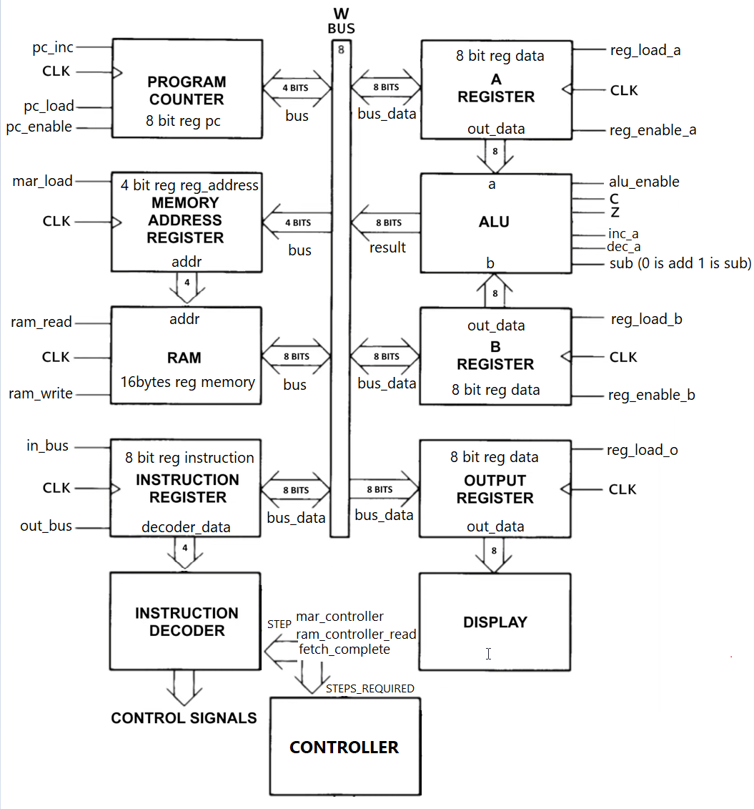
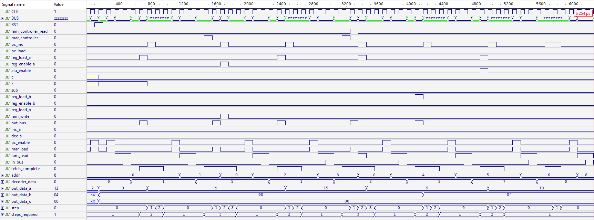

# Simple as Possible 8-bit Processor

A minimalist 8-bit processor implemented in Verilog. 

## Architecture

The processor features:
- 8-bit data bus architecture
- 4-bit addressing (16 bytes of RAM)
- von Neumann architecture
- Two general-purpose registers (A and B)
- ALU with add, subtract, increment, and decrement operations
- Conditional and unconditional jumps using carry and zero flags

### Schema
  


## Instruction Set

| Opcode (Binary) | Instruction | Description |
|-----------------|-------------|-------------|
| 0000 | NOP | No operation |
| 0001 | MOV A, imm | Load immediate value to register A |
| 0010 | MOV B, imm | Load immediate value to register B |
| 0011 | LOAD A, [addr] | Load from memory to register A |
| 0100 | LOAD B, [addr] | Load from memory to register B |
| 0101 | STORE A, [addr] | Store register A to memory |
| 0110 | STORE B, [addr] | Store register B to memory |
| 0111 | ADD A, B | Add B to A |
| 1000 | SUB A, B | Subtract B from A |
| 1001 | OUT A | Output register A |
| 1010 | OUT B | Output register B |
| 1011 | JMP addr | Jump to address |
| 1100 | JZ addr | Jump if zero flag is set |
| 1101 | JC addr | Jump if carry flag is set |
| 1110 | INC A | Increment register A |
| 1111 | DEC A | Decrement register A |

## Key Components

- **Program Counter**: Tracks the current instruction address
- **ALU**: Performs arithmetic and logical operations
- **Registers**: Storage for operands and results
- **Instruction Decoder**: Translates opcodes into control signals
- **Controller**: Manages instruction fetch and execute cycle
- **RAM**: 16 bytes of instruction/data memory
- **Output Register**: Displays computation results

## Sample Program

The processor comes pre-loaded with a simple program.

## Sample Output
  
## Sample Program & Output

```assembly
; Load values, store and retrieve from memory, then perform addition
MOV A, 9      ; Load value 9 into register A
STORE A, 0    ; Store the value from register A to memory address 0
MOV A, 15     ; Load new value 15 into register A
LOAD A, 0     ; Load value from memory address 0 back into register A (should be 9)
MOV B, 4      ; Load value 4 into register B
ADD A, B      ; Add registers A and B (9 + 4 = 13), result in register A
```

## Usage

This project can be simulated in any Verilog-compatible simulator. The main testbench is in the `cpu_top.v` file.
